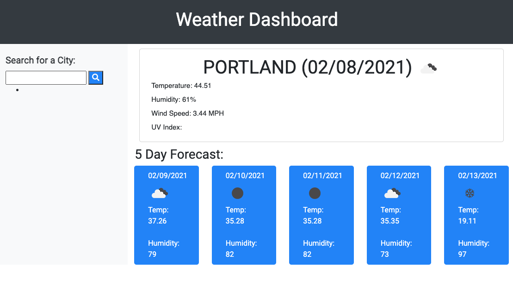

# Weather Dashboard 
### Homework 5 - David Bushard

 

## For this Project I used:
* HTML
* CSS
* JavaScript
* BOOTSTRAP
* APIs
    * https://openweathermap.org/api
    * https://moment.github.io/luxon/

 
 

# Critiria for Assignment. 

* A weather dashboard with form inputs
Search for a city I am presented with current and future conditions for that city and that city is added to the search history
* I view current weather conditions for that city and am presented with the city name, the date, an icon representation of weather conditions, the temperature, the humidity, the wind speed, and the UV index
View the UV index I am presented with a color that indicates whether the conditions are favorable, moderate, or severe.
* I view future weather conditions for that city
* I am presented with a 5-day forecast that displays the date, an icon representation of weather conditions, the temperature, and the humidity

 

Links to Repo and Live Page:

### https://github.com/DavidBuoy/weather-dashboard

### https://davidbuoy.github.io/weather-dashboard/

 
 

# Screenshots & Gif

 
 

